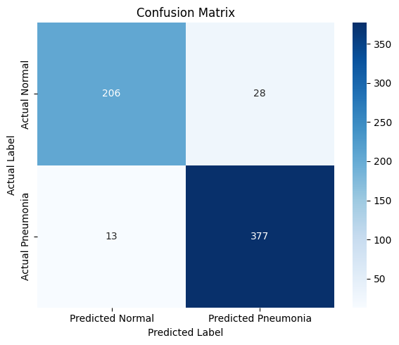
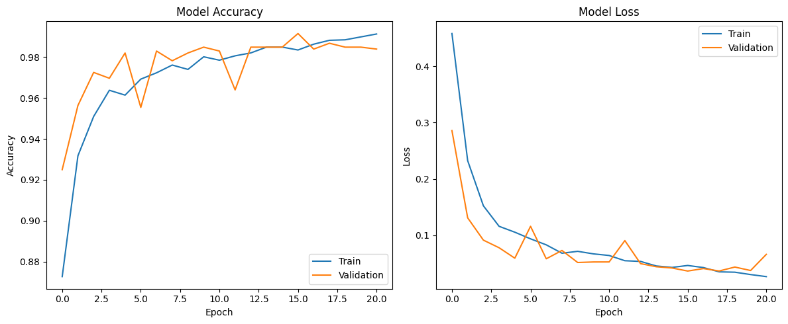

# DS-4002-Project-3

# Chest X-Ray Image Classification (DS 4002 Project 3)

## 📌 Project Overview

This project applies image classification using a pre-trained EfficientNetV2S model to distinguish between **normal** and **pneumonia** chest X-ray images. The dataset is split into training, validation, and test sets, and a transfer learning approach is used to improve performance with limited computational resources.

## 🎯 Goals

- Classify chest X-rays as either **normal** or **pneumonia**
- Fine-tune a pre-trained CNN to maximize performance
- Evaluate the model using precision, recall, accuracy, and F1-score

## 🧠 Model

- Architecture: **EfficientNetV2S**
- Layers: GlobalAveragePooling2D + Dense + Dropout
- Optimizer: Adam
- Loss: Binary Crossentropy
- Epochs: Set to 30, **stopped early at 21** using early stopping
- Fine-tuned base model (after initial training)

## 📊 Performance Summary (on Test Set)

| Metric        | Value    |
|---------------|----------|
| Accuracy      | **93.4%** ✅ |
| Normal Recall | 88.0% |
| Pneumonia Recall | 96.7% |
| F1 Score (Avg) | ~92.9% |

### ✅ Confusion Matrix

### 📈 Training History

## 📁 Project Structure

